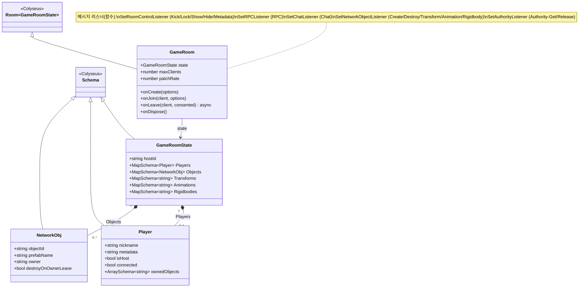

# 서버 측 클래스 다이어그램 (TypeScript)

`Server/src/` — `GameRoom`이 `GameRoomState`를 권위(authoritative) 상태로 보유하며,
클라이언트가 보내는 메시지를 검증·반영합니다.

> [문서 목록으로 돌아가기](00-Index.md)

---

## 클래스 다이어그램

---

## 주요 메시지 핸들러 (`GameRoom.ts`)

| 그룹 | 메시지 | 설명 |
|------|--------|------|
| Room Control | `Kick`, `Lock`, `Unlock`, `Show`, `Hide`, `Metadata-Set`, `Metadata-Get` | 호스트 권한으로 방 제어 |
| RPC | `RPC` | `All` / `Other` / 특정 세션 대상 원격 호출 |
| Chat | `Chat` | 다른 클라이언트에게 채팅 브로드캐스트 |
| Network Object | `Create`, `Destroy`, `Transform`, `Animation`, `Rigidbody` | 객체 생성·파괴 및 상태 동기화(소유권 검증) |
| Authority | `Authority-Get`, `Authority-Release` | 객체 소유권 획득/반환 |
