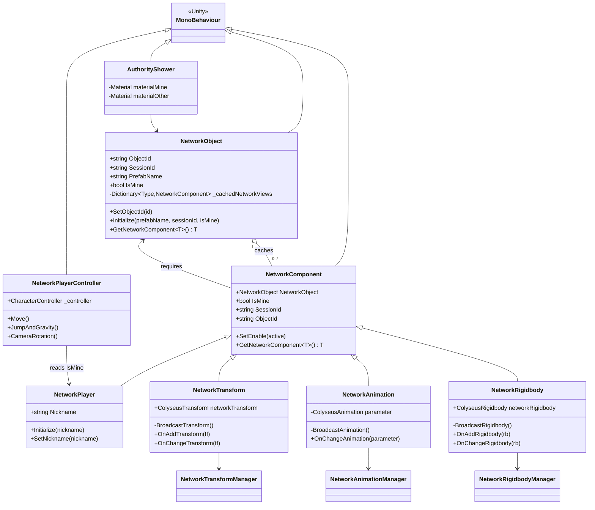

# 클라이언트 — 네트워크 컴포넌트 계층 (Unity C#)

`Assets/Colyseus_Client/Scripts/Component/` — `NetworkObject`(정체성)에
`NetworkComponent` 파생 클래스들(동기화 동작)을 합성(composition)하는 구조입니다.

> [문서 목록으로 돌아가기](00-Index.md)

---

## 클래스 다이어그램

---

## 설명

- **`NetworkObject`** — 객체의 정체성(`ObjectId`, `SessionId`, `IsMine`)을 보유하고, 부착된 `NetworkComponent`들을 타입별로 캐싱합니다.
- **`NetworkComponent`** — 모든 동기화 컴포넌트의 베이스. `[RequireComponent(typeof(NetworkObject))]`로 `NetworkObject` 부착을 강제합니다.
- **`NetworkTransform` / `NetworkAnimation` / `NetworkRigidbody`** — `IsMine`이면 자신의 상태를 Broadcast하고, 아니면 서버 상태를 보간(lerp)하여 반영합니다.
- **`NetworkPlayerController`** — 로컬 플레이어의 입력·이동·카메라를 처리하며 `NetworkPlayer.IsMine`으로 활성화 여부를 판단합니다.
- **`AuthorityShower`** — 소유권 여부(`IsMine`)에 따라 머티리얼을 교체하는 시각화용 보조 컴포넌트입니다.
