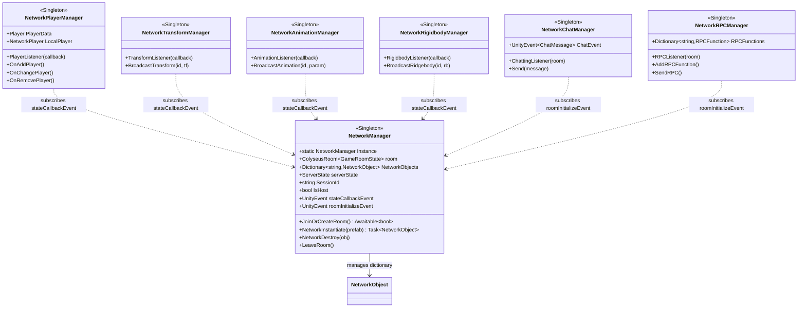

# 클라이언트 — 매니저 계층 (Unity C#)

`Assets/Colyseus_Client/Scripts/Manager/` — 7개의 매니저가 각각 한 가지 책임을 담당하며,
`NetworkManager`의 이벤트를 구독해 느슨하게 결합됩니다.

> [문서 목록으로 돌아가기](00-Index.md)

---

## 클래스 다이어그램

---

## 매니저별 책임

| 매니저 | 책임 | 구독 이벤트 |
|--------|------|-------------|
| `NetworkManager` | 룸 연결/생성, 네트워크 객체 인스턴스화·파괴, 상태 콜백 라우팅 | (이벤트 발행자) |
| `NetworkPlayerManager` | 플레이어 추가/변경/제거, 로컬 플레이어 생성 | `stateCallbackEvent` |
| `NetworkTransformManager` | Transform 동기화 송수신 | `stateCallbackEvent` |
| `NetworkAnimationManager` | 애니메이션 파라미터 동기화 송수신 | `stateCallbackEvent` |
| `NetworkRigidbodyManager` | Rigidbody 물리 상태 동기화 송수신 | `stateCallbackEvent` |
| `NetworkChatManager` | 채팅 메시지 송수신 | `roomInitializeEvent` |
| `NetworkRPCManager` | 원격 함수 호출(RPC) 등록·송수신 | `roomInitializeEvent` |
