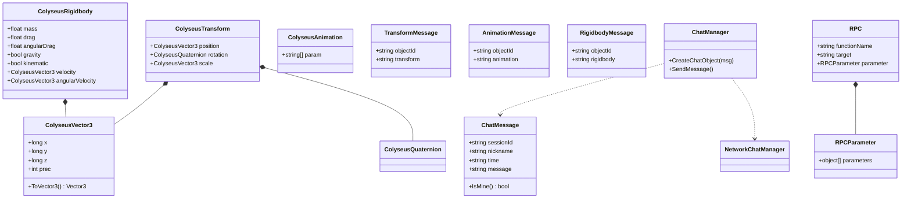

# 클라이언트 — 데이터 / 메시지 / 보조 클래스 (Unity C#)

`Assets/Colyseus_Client/` — 네트워크로 직렬화되어 전송되는 데이터 구조와
채팅·RPC 등 보조 클래스들입니다.

> [문서 목록으로 돌아가기](00-Index.md)

---

## 클래스 다이어그램

---

## 분류

### 동기화 데이터 (`Schema/`)
- **`ColyseusTransform`** — 위치·회전·크기를 묶은 트랜스폼 데이터
- **`ColyseusVector3`** — 정밀도(`prec`) 기반으로 `float`를 `long`으로 양자화하여 대역폭 절약
- **`ColyseusQuaternion`** — 회전 데이터
- **`ColyseusRigidbody`** — 질량·항력·속도 등 물리 상태
- **`ColyseusAnimation`** — Animator 파라미터 배열

### 메시지 (`Scripts/Message/`)
- **`TransformMessage` / `AnimationMessage` / `RigidbodyMessage`** — `objectId`와 직렬화된 상태 문자열을 담아 서버로 전송하는 래퍼

### 보조 클래스
- **`ChatMessage` / `ChatManager`** — 채팅 데이터 및 UI 처리
- **`RPC` / `RPCParameter`** — 원격 함수 호출 페이로드
