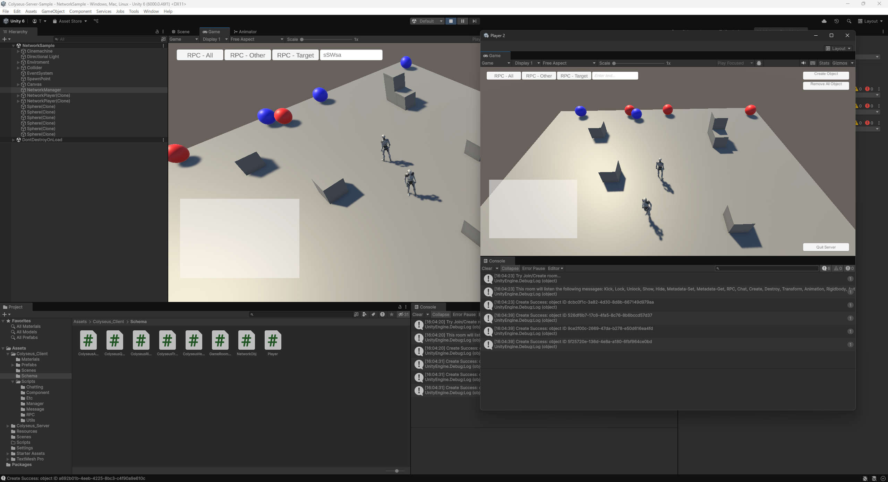

# colyseus-server-sample


- [colyseus-server-sample](#colyseus-server-sample)
  - [Introduction](#introduction)
  - [Features](#features)
  - [Requirements](#requirements)
  - [Project Structure](#project-structure)
  - [How to Install](#how-to-install)
  - [Quick Start](#quick-start)
  - [Architecture \& Documentation](#architecture--documentation)
  - [Schema Sync Workflow](#schema-sync-workflow)
  - [Manual](#manual)
  - [License](#license)

## Introduction



시연 영상 : https://youtu.be/MQoHwoaRE1k

**[Colyseus](https://github.com/colyseus)** 기반으로 작성된 Unity용 클라이언트-서버 코드 샘플입니다.
서버가 권위(authoritative) 상태를 보유하고, Unity 클라이언트는 이 상태를 구독·동기화하는 구조로 동작합니다.

## Features

1. Transform 동기화
2. Animation 동기화
3. Rigidbody 동기화 (실험적 기능, **매우 비쌈**)
4. 오브젝트 생성, 파괴
5. RPC
6. 채팅

## Requirements

| 구분 | 버전 |
|------|------|
| Unity | **6000.0.46f1 이상** (개발 기준: 6000.2.6f2) |
| Node.js | **20.9.0 이상** |
| Colyseus | 0.16.x |

> 멀티플레이어 동시 테스트를 위해 Unity의 **Multiplayer Play Mode** 패키지가 필요합니다.

## Project Structure

```
Colyseus-Server-Sample/
├── Assets/
│   └── Colyseus_Client/          # Unity 클라이언트 코드
│       ├── Schema/               # 서버 스키마에서 자동 생성된 C# 클래스 (schema-codegen)
│       └── Scripts/
│           ├── Manager/          # 싱글톤 매니저 (연결/플레이어/동기화/채팅/RPC)
│           ├── Component/        # NetworkObject / NetworkComponent 계층
│           ├── Message/          # 서버 전송용 메시지 래퍼
│           ├── Chatting/         # 채팅 UI
│           └── RPC/              # RPC 샘플
├── Server/                       # Colyseus 서버 (TypeScript)
│   └── src/
│       ├── rooms/GameRoom.ts     # 룸 로직 및 메시지 핸들러
│       └── rooms/schema/         # 권위 상태 스키마 (GameRoomState/Player/NetworkObj)
└── Docs/                         # 클래스 다이어그램 문서
```

## How to Install

별도 UnityPackage는 **제공되지 않으며** Repository를 직접 복사해서 사용하면 됩니다.

## Quick Start

1. Repository를 다운로드 받습니다.
2. **Unity 6000.0.46f1 이상 버전**으로 다운로드 받은 Repository 폴더를 엽니다.
3. Unity 에디터 내에서 Colyseus_Client/Scenes/NetworkSample.unity Scene을 엽니다.
4. 터미널 상에서 `Server` 폴더로 이동한 후 `npm install`로 의존성을 설치하고 `npm start` 명령어를 실행해 로컬 서버를 실행합니다.
5. Unity 에디터 상에서 Multiplayer Play Mode 기능을 활성화한 뒤 원하는 만큼 Virtual Player를 추가합니다.
6. Unity 에디터 상에서 Play mode에 진입한 뒤 각각의 Player에서 `Start Server` 버튼을 클릭합니다.
7. Enjoy :)

## Architecture & Documentation

프로젝트의 클래스 구조는 `Docs/` 폴더에 분류별 클래스 다이어그램으로 정리되어 있습니다.

| 문서 | 내용 |
|------|------|
| [Docs/00-Index.md](Docs/00-Index.md) | 문서 목록 (목차) |
| [Docs/01-Server.md](Docs/01-Server.md) | 서버 측 — `GameRoom` + 상태 스키마, 메시지 핸들러 |
| [Docs/02-Client-Components.md](Docs/02-Client-Components.md) | 클라이언트 — 네트워크 컴포넌트 계층 |
| [Docs/03-Client-Managers.md](Docs/03-Client-Managers.md) | 클라이언트 — 매니저 계층 (싱글톤) |
| [Docs/04-Client-Data.md](Docs/04-Client-Data.md) | 클라이언트 — 데이터 / 메시지 / 보조 클래스 |
| [Docs/05-Overview.md](Docs/05-Overview.md) | 전체 동작 요약 및 핵심 설계 패턴 |

핵심 설계 요약:

- **권위 모델(Server-authoritative)** — 서버가 소유권(`owner`)을 검증하고, 클라이언트는 `IsMine`으로 송신/수신을 분기합니다.
- **싱글톤 매니저** — 연결·플레이어·트랜스폼·애니메이션·리지드바디·채팅·RPC를 각각 전담하는 매니저로 분리되어 있습니다.
- **컴포넌트 합성** — `NetworkObject`(정체성)에 `NetworkComponent` 파생들(동기화 동작)을 부착하는 구조입니다.

## Schema Sync Workflow

서버의 상태 스키마(`Server/src/rooms/schema/`)는 클라이언트의 C# 스키마(`Assets/Colyseus_Client/Schema/`)와 **반드시 일치**해야 합니다.
서버 스키마를 수정한 뒤에는 아래 명령으로 C# 코드를 재생성하세요.

```bash
cd Server
npm run schema-codegen
```

> 이 명령은 `@colyseus/schema`의 codegen 도구로 `src/rooms/schema/*` 를 읽어
> `../Assets/Colyseus_Client/Schema/` 에 C# 클래스를 자동 생성합니다.
> 생성된 파일은 **직접 수정하지 마세요.**

## Manual

[Manual](MANUAL.md) 문서를 참고해주세요.

## License

이 샘플 프로젝트를 제작하는데에 [Colyseus](https://github.com/colyseus/colyseus)가 사용되었습니다. 자세한 내용은 [해당 에셋의 라이선스](Server/LICENSE)를 참고해주세요.

이 샘플 프로젝트를 제작하는데에 [Colyseus Unity SDK](https://github.com/colyseus/colyseus-unity-sdk?tab=readme-ov-file)가 사용되었습니다. 자세한 내용은 [해당 에셋의 라이선스](Assets/Colyseus_Server/LICENSE)를 참고해주세요.

이 샘플 프로젝트를 제작하는데에 Unity에서 제공하는 [Starter Assets](https://assetstore.unity.com/packages/essentials/starter-assets-character-controllers-urp-267961) 에셋이 사용되었습니다. 자세한 내용은 [해당 에셋의 라이선스](https://unity.com/kr/legal/licenses/unity-companion-license)를 참고해주세요.

나머지 제가 작성한 코드는 MIT License를 따릅니다.
